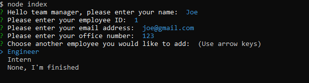

# TeamProfileGenerator

## Description
A node.js application that allows you to generate a team profile webpage. On start, the application prompts the team manager for their information. Afterwards, you can add as many employees to the roster as you want. Employee types include "Engineer" and "Intern" and they all get rendered to an html page in the "/dist" folder.

## Installation
Clone the GitHub repository here https://github.com/Chance-Crawford/TeamProfileGenerator

Cd to project root, type command npm init.

type node index.js to run app from project's root.

## Video Demonstration
https://www.youtube.com/watch?v=XMkfIk8mrVU